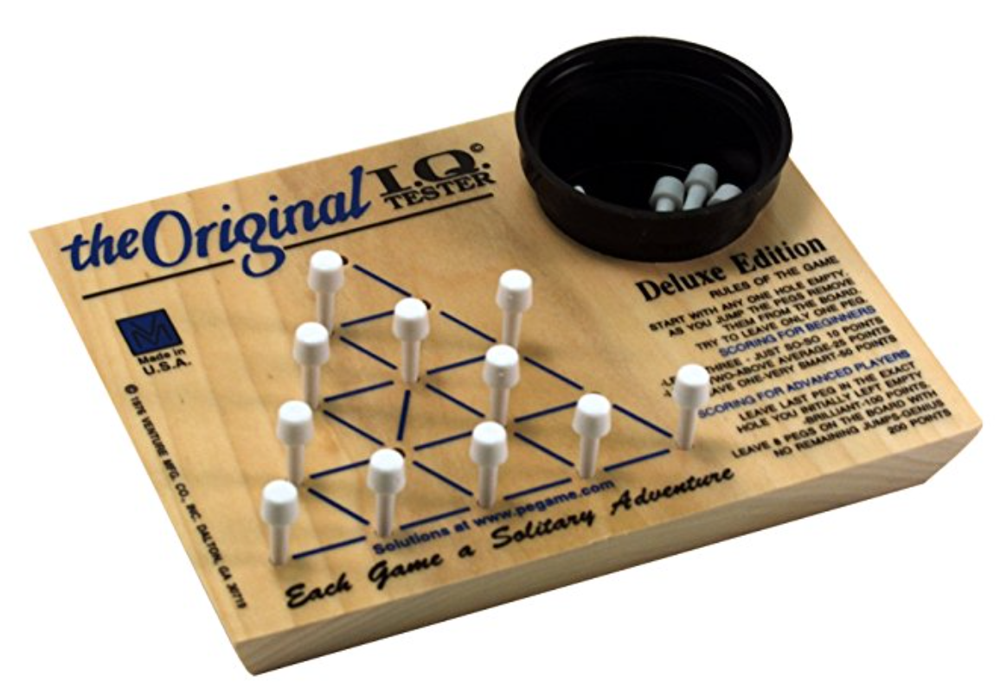

By Oscar Bennett, 2018

This code computes all possible solutions the The Original IQ Tester puzzle. In it's current form in picks out all the outcomes with either 8 or 1 pegs left at the end and displays the sequence of moves to reach them.

See here for details of the puzzle and rules:

<https://www.amazon.com/Channel-Classic-Challenging-Handcrafted-Original/dp/B001XM3DGM>

There are approx 1 million possible game sequences when a grid of depth of 5 is chosen (grid depth = rows in the grid, the wooden game shown has a depth of 5) but this increases quickly if larger grids are chosen.
